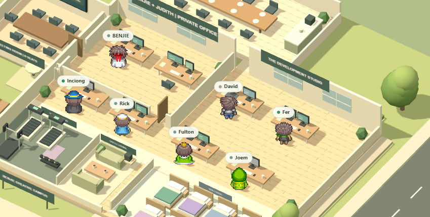

<div align="center">

# Hermes Team HQ

### A living virtual office for an AI-assisted development team

[](https://webjie28.github.io/MY-PERSONAL-TEAM-AGENT/)


**[Open the live campus →](https://webjie28.github.io/MY-PERSONAL-TEAM-AGENT/)**

</div>

---



## What this is

Hermes Team HQ turns a multi-agent development workflow into a visual office. It shows who is working, what each specialist owns, recorded activity, the shared project board, and scheduled personal routines in one interactive campus.

The public site is a safe, read-only showcase. BENJIE's private localhost dashboard remains the operational control plane connected to Hermes, Telegram topics, the review ledger, and task creation.

## Inside the campus

- Interactive isometric office rendered with Three.js
- Individual workstations, a 12-seat meeting room with an open doorway, lounge, dining area, gym, covered smoking area, nine-bed staff rest wing, and a private queen bed for BENJIE and Judith
- Seven specialist profiles with roles, skills, active assignments, and work-time summaries
- Team and skills directory
- Shared development board
- Owner review desk interface
- Responsive layout for desktop and smaller screens

## Team and operating ideas

| Team member | Position | What they can own independently | What comes back to BENJIE |
| --- | --- | --- | --- |
| Judith | Lead Senior · Technical Research & Architecture | Research options, compare APIs, write architecture decisions, identify technical and security risks | Recommended direction, sources, trade-offs, and any high-risk decision |
| David | Senior Product Engineer | Turn a goal into requirements, user stories, edge cases, and acceptance criteria | Product brief and decisions that change scope |
| Fer | Senior Frontend Engineer | Build responsive interfaces, reusable components, accessibility, and browser behavior | Visual preview, implementation report, and UI decisions needing approval |
| Inciong | Senior Developer Tooling Engineer | Improve scripts, automation, local tooling, build checks, and repeatable workflows | Tooling changes, command output, and environment-impacting proposals |
| Rick | Senior Full-stack Engineer | Implement application flows, APIs, data integration, validation, and performance fixes | Working feature, test evidence, and data/schema changes |
| Fulton | Senior QA & Security Engineer | Create tests, reproduce defects, run regression checks, and review common security risks | Pass/fail report, evidence, blockers, and release recommendation |
| Joem | Senior DevOps & Release Engineer | Prepare CI/CD, preview releases, health checks, observability, and rollback instructions | Release candidate and exact deployment request; production remains approval-gated |
| Red | Senior Backend & Data Engineer | Build secure APIs, authentication, data models, migrations, and server-side validation | Schema changes, access requirements, migration evidence, and production-impacting decisions |
| Espina | Senior UI/UX & Design Systems Designer | Create user flows, wireframes, prototypes, reusable design tokens, and usability reviews | Design direction, interactive prototype, accessibility decisions, and visual sign-off |
| Marielle | Senior QA Automation & Acceptance Lead | Convert acceptance criteria into E2E, cross-browser, mobile, and release-readiness tests | Independent acceptance report, evidence, failures, and release recommendation |

BENJIE remains the owner, project manager, engineering-standards lead, code reviewer, and final approver. Judith additionally owns documentation and knowledge management, so architectural decisions, sources, runbooks, and handoffs stay connected instead of becoming a separate documentation silo.

### How autonomous are they?

They are **role-based AI agents, not conscious people**. They do not have feelings, personal beliefs, or a human mind. Within an assigned task, however, each agent can inspect context, break work into steps, use allowed local tools, produce artifacts, test its work, report blockers, and recommend the next action.

Their autonomy is deliberately bounded:

1. BENJIE provides the objective and constraints.
2. The assigned specialist plans and executes only within its role and available permissions.
3. The agent records evidence and submits a report when work is ready, blocked, or complete.
4. The report remains in the **Approval inbox** until BENJIE approves, holds, sends it back, or adds an instruction.
5. Production deployment, cloud access, secrets, public publishing, and destructive actions never become automatic merely because an agent finished its task.

## 24/7 approval inbox

The private localhost dashboard stores review items and decisions in a local SQLite ledger. `review`, `done`, `blocked`, and access-request items remain available when BENJIE is away and appear again in **Review desk → Approval inbox · 24/7** when the dashboard is reopened.

```text
Assigned → Agent works → Tests and report → Approval inbox
                                              ├─ Approve
                                              ├─ Hold
                                              ├─ Send back
                                              └─ Instruct
```

“24/7 inbox” means the queue is durable and can receive reports while the Hermes processes and computer are running. It does not claim that agents keep executing while the host computer is powered off. The public GitHub Pages site stays read-only and never exposes the private approval ledger.

## Architecture

```text
Public GitHub Pages              Private localhost
──────────────────              ─────────────────
Read-only preview data           Live Hermes status
Three.js campus                  Telegram topic links
Team / skills / board UI         Task assignment
No credentials                   Approval ledger
No write-capable API             Local filesystem access
```

This separation prevents a public static site from becoming an exposed administration panel.

## Technology and languages

| Layer | Technology | Use |
| --- | --- | --- |
| Interface | HTML5, CSS3 | Accessible structure, responsive dashboard, visual campus shell |
| Application | Modern JavaScript ES modules | Status UI, board, review desk, scheduling, interactions |
| Campus rendering | Three.js + WebGL | Isometric office, rooms, furniture, movement, camera controls |
| Characters | WorkAdventure/Pipoya-compatible sprites | Standing, walking, working, resting, and personal-routine states |
| Private control plane | Python + SQLite | Local API, Hermes status aggregation, durable approval ledger |
| Delivery | GitHub Actions + GitHub Pages | Automated read-only public deployment |

GitHub's language panel is generated automatically from tracked source files. The README badges mirror the current repository mix shown by GitHub: JavaScript 61.7%, CSS 32.2%, and HTML 6.1%. Python powers the private localhost control plane and is intentionally excluded from the public static build.

## Run locally

Clone the repository, then serve it over HTTP:

```bash
python -m http.server 8080
```

Open `http://localhost:8080`. Opening `index.html` directly is not supported because the browser must load JavaScript modules over HTTP.

## Deployment

Every push to `main` deploys through the included GitHub Pages workflow. The workflow requires no repository secrets.

## Security and privacy

The public repository intentionally excludes:

- Telegram chat and topic URLs
- Local Hermes paths and databases
- Review decisions and approval tokens
- Environment files and credentials
- Write-capable task, leave, deployment, or access APIs

## Asset attribution

Character sprites are based on assets used by the WorkAdventure map starter ecosystem. Review the upstream [WorkAdventure map starter kit](https://github.com/workadventure/map-starter-kit) and preserve the applicable asset licenses when redistributing or modifying them.

---

<div align="center">
Built for BENJIE's development team.
</div>
